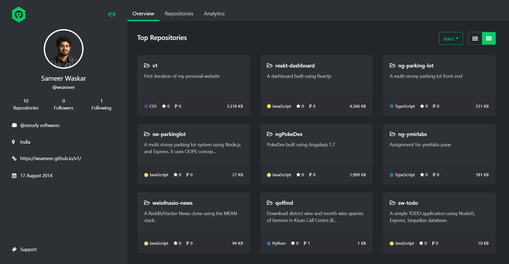

## Octoprofile Plus

<!-- ALL-CONTRIBUTORS-BADGE:START - Do not remove or modify this section -->

<!-- ALL-CONTRIBUTORS-BADGE:END -->

A nicer look at your GitHub Profile! With themes, charts and React!

### Features

-   Search any github user or organization
-   View top 10 repositories, and toggle between grid and list view.
-   Sort the repositories based on count of forks, stars, size.
-   Visualization charts showing top language contribution of a user.
-   View all the repositories a user has created or forked.

### Built using

-   Reactjs
-   React Hooks
-   GitHub API
-   React Bootstrap
-   React Chartjs 2

### Installation

1. Install dependencies

    `yarn`

2. Run the app locally

    `yarn start`

Runs the app in the development mode.  
Open [http://localhost:3000](http://localhost:3000/) to view it in the browser.

The page will reload if you make edits.  
You will also see any lint errors in the console.

### Deployment

    `yarn build`

Builds the app for production to the `build` folder.  
It correctly bundles React in production mode and optimizes the build for the best performance.

The build is minified and the filenames include the hashes.  
Your app is ready to be deployed!

## Contributors ✨

Thanks goes to these wonderful people ([emoji key](https://allcontributors.org/docs/en/emoji-key)):

<!-- ALL-CONTRIBUTORS-LIST:START - Do not remove or modify this section -->
<!-- prettier-ignore-start -->
<!-- markdownlint-disable -->
<table>
  <tr>
    <td align="center"><a href="http://agreon.de"> <b>Daniel Huth</b></a> <a href="https://github.com/wsameer/octoprofile-plus/issues?q=author%3AAgreon" title="Bug reports">🐛</a></td>
    <td align="center"><a href="https://wsameer.github.io/v1/"> <b>Sameer Waskar</b></a> <a href="https://github.com/wsameer/octoprofile-plus/commits?author=wsameer" title="Code">💻</a> <a href="https://github.com/wsameer/octoprofile-plus/issues?q=author%3Awsameer" title="Bug reports">🐛</a> <a href="#design-wsameer" title="Design">🎨</a> <a href="#maintenance-wsameer" title="Maintenance">🚧</a> <a href="https://github.com/wsameer/octoprofile-plus/commits?author=wsameer" title="Tests">⚠️</a></td>
    <td align="center"><a href="https://nishchay17.netlify.com/"> <b>Nishchay</b></a> <a href="https://github.com/wsameer/octoprofile-plus/issues?q=author%3Anishchay17" title="Bug reports">🐛</a> <a href="https://github.com/wsameer/octoprofile-plus/commits?author=nishchay17" title="Code">💻</a></td>
    <td align="center"><a href="https://github.com/error434"> <b>error434</b></a> <a href="https://github.com/wsameer/octoprofile-plus/commits?author=error434" title="Code">💻</a></td>
  </tr>
</table>

<!-- markdownlint-restore -->
<!-- prettier-ignore-end -->

<!-- ALL-CONTRIBUTORS-LIST:END -->

This project follows the [all-contributors](https://github.com/all-contributors/all-contributors) specification. Contributions of any kind welcome!
